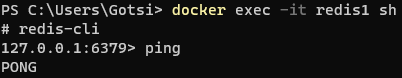
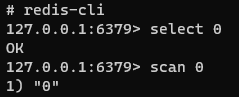
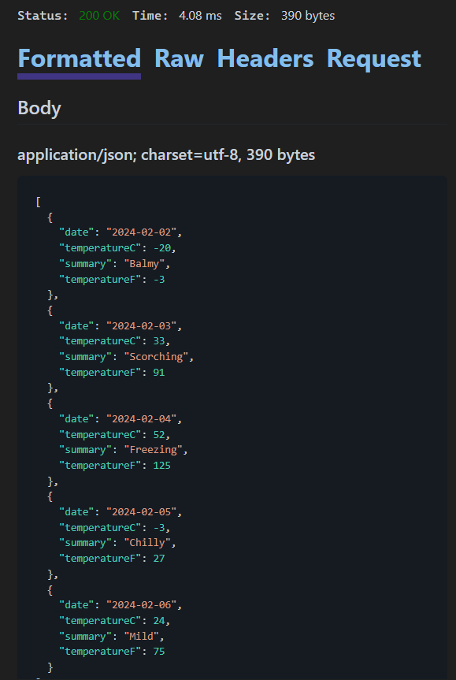

# Redis demo
This project serves as a demonstration of using Redis in a .NET application. It showcases how to run a Redis instance in Docker and connect it to your .NET application.

## Prerequisities
Before running the demo, ensure you have Docker instaled on your system.

## Running Redis in Docker
```bash
docker run --name redis1 -p 5002:6379 -d redis
```

## Accessing Redis interactively
```bash
docker exec -it redis1 sh
```
Once inside the container, type redis-cli to access the Redis command-line interface.



Upon starting the Redis instance, the cache is initially empty.



## Performance Analysis
### Cold start time, about 46ms


### Cached request time, about 4ms


## Code snippets
This code snippet demonstrates how to integrate Redis caching into a .NET application using the StackExchange.Redis package. It sets up a distributed cache with Redis and utilizes it to cache weather forecast data.

### IDistributedCache extensions
```csharp
public static class DistributedCacheExtensions
{
    public static async Task SetRecordAsync<T>(this IDistributedCache cache,
        string recordId,
        T data,
        TimeSpan? absoluteExpireTime = null,
        TimeSpan? unusedExpireTime = null)
    {
        var ops = new DistributedCacheEntryOptions();

        ops.AbsoluteExpirationRelativeToNow = absoluteExpireTime ?? TimeSpan.FromSeconds(60);
        ops.SlidingExpiration = unusedExpireTime;

        var jsonData = JsonSerializer.Serialize(data);

        await cache.SetStringAsync(recordId, jsonData, ops);
    }

    public static async Task<T?> GetRecordAsync<T>(this IDistributedCache cache, string recordId)
    {
        var jsonData = await cache.GetStringAsync(recordId);

        if (jsonData is null)
            return default(T);

        return JsonSerializer.Deserialize<T>(jsonData);
    }
}
```
Description:

SetRecordAsync<T>: This method stores a serialized data object of type T in the distributed cache with the specified record ID. It allows configuring absolute and sliding expiration times for the cache entry. If no expiration times are provided, it defaults to a 60-second absolute expiration time.

GetRecordAsync<T>: This method retrieves a serialized data object of type T from the distributed cache using the specified record ID. If the record is not found in the cache, it returns null. Otherwise, it deserializes the JSON data and returns the object.

### Initialize the web application and configure Redis cache

```csharp
using System.Reflection;
using Caching.Repository.Extensions;
using Microsoft.Extensions.Caching.Distributed;

var builder = WebApplication.CreateBuilder(args);

builder.Services.AddStackExchangeRedisCache(ops =>
{
    ops.Configuration = builder.Configuration.GetConnectionString("Redis");
    ops.InstanceName = $"{Assembly.GetExecutingAssembly().GetName().Name}_";
});

var app = builder.Build();
```

### Define API Endpoint
```csharp
app.MapGet("/weatherforecast", async (IDistributedCache cache) =>
{
	var key = $"WeatherForecast_{DateTime.Now.Date.ToString("yyyyMMdd_hhmm")}";
	var forecast = await cache.GetRecordAsync<WeatherForecast[]>(key);

	if (forecast is not null) return forecast;

	forecast = ListWeatherForecast();
	await cache.SetRecordAsync(key, forecast);

	return forecast;
})
.WithName("GetWeatherForecast")
.WithOpenApi();
```